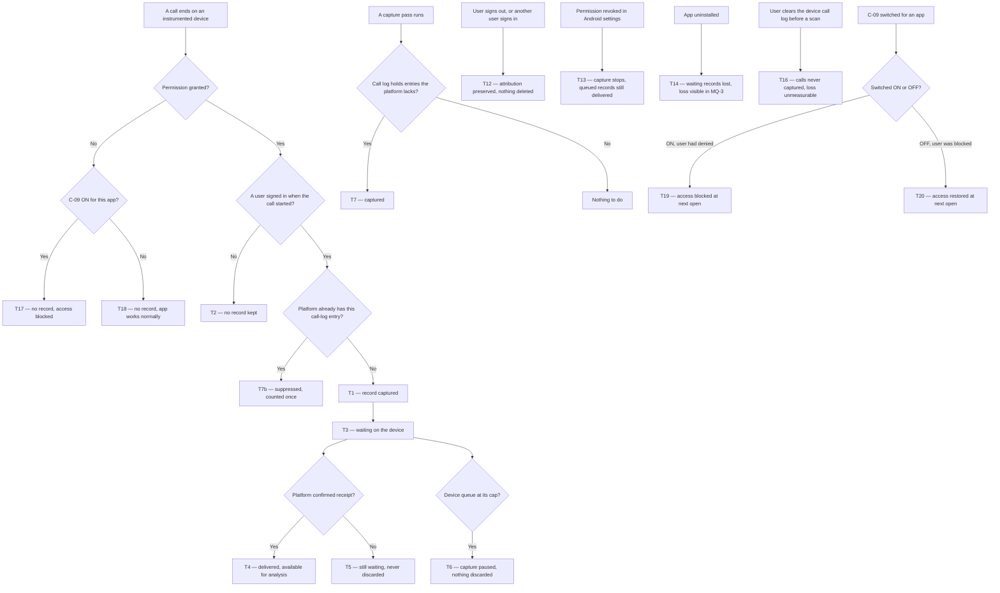

# Call Logs — measuring how partner-side calls really connect

| | | | |
|---|---|---|---|
| **Owner** — Ashish Raj (PM) | **Reviewer** — Saurabh Goyal (Engineering Lead) | **Status** — In review | **Sign-off** — Blocked on Legal re-review (OV-6) |
| **Version** — v1.7 · 31 Jul 2026 | **Consulted — Legal / Compliance** — **Re-review required** (OV-6) | **Consulted — CSP App Eng** — TBD (OV-3) | **Consulted — Technician App Eng** — TBD (OV-3) |

**v1.1 change:** the mandatory-permission gate is now a per-app switch (C-09) that **defaults OFF**. v1.0 hard-wired it ON. See R10, T17–T20, OV-2.

**v1.7 change:** acceptance criteria audited for capture that reads the device log at a point in time rather than per call. R4a no longer mandates a capture trigger; R2a now requires the account signed in **when the call happened**, not at capture; T13 states that calls no pass has read are lost once permission is revoked. 17 ACs made trigger-neutral, AC-ATT-5 and AC-ATT-6 added for the two cases delayed capture creates. AC-GATE-6 reversed: a pass takes whatever the log holds, including calls from before the grant, and R10 MUST NOT (b) narrowed to match.

**v1.6 change:** the spec is cut to what a logging spec needs. Removed: M4, R6, R8, R9, and every configurable parameter except C-09. Whether a number is a Wiom IVR number is now decided **in SQL at analysis time**, not stored on the record — so the classification transitions (T8–T11), the number register, and Appendix A fields 27 and 28 all go. Retention becomes a flat "kept indefinitely" rather than a parameter, which also removes the purge path (T15). Delivery windows, catch-up horizon and queue caps become the implementer's engineering choices. 14 acceptance criteria retired with the rules they tested (OV-9).

**v1.5 change:** guardrails reduced to three. G2, G3 and G6 are retired and G1 is replaced by **app behaviour unchanged** — the one promise worth holding on every path is that the apps keep working exactly as they do today (OV-8). Every retired obligation survives as a rule: R6 honest reporting, R1 MUST NOT (a) no content, R5a the grant gate, R9 restricted access. Adds MQ-9 and AC-GRD-10. Also fixes three review findings: T1 no longer contradicts R1a, the C-01×C-04 note no longer cites the deleted settings screen, and the Boundary no longer claims incentive systems receive per-user data.

**v1.4 change:** no partner-facing disclosure. The purpose-notice screen, the settings status screen and the experience-intent line are removed; R5 is reduced to the permission-grant gate and R5a to "no capture without grant". R9 can no longer rest on disclosure, so it becomes *internal use, restricted access*. The Android permission dialog remains — the OS forces it and Wiom cannot suppress it (OV-6).

**v1.3 change:** **Appendix A** lands — the full recorded field inventory — 28 fields on every record, and up to 10 more where the device provides them (OV-4). R1 gains (g): capture every Tier 1 and Tier 2 field, and record absence rather than omitting silently. Per-user analysis is now permitted, which reverses v1.2 — R9 becomes *disclosed purpose*, R7 is inverted, and **Legal must re-review** (OV-5).

**v1.2 change:** the recorded field set is completed. R1 gains four obligations — a call-log entry identity so "capture once" is verifiable (d), which app produced the record (e), captured-at and received-at times (f), and a four-value outcome replacing the connected/not-connected boolean (a). R8 gains (c): the classification is stored, not recomputed on read. R1 MUST NOT gains (b): no handset model, manufacturer, OS or app version — the record stays minimal.

---

## Quick Check

Seven-line triage. Reflects the body below; if it disagrees, the body wins. Not a Template v3 section — see **OV-7**.

| Question | Answer |
|---|---|
| What problem? | Wiom cannot say how many partner↔customer calls bypass the IVR, or how well the IVR connects compared with ordinary dialling. A device-side call-log pipeline used to exist in the legacy partner app; it decayed as partners migrated and stopped entirely on **7 Jul 2026**. Neither new app declares the permission. |
| Primary owner? | Cross-cutting measurement capability. Instrumented surfaces: CSP App (`com.wiom.csp`) and Technician App. |
| Customer outcome? | None — this is an internal-capability PRD. Recorded as **OV-1**. |
| Money flow change? | No. |
| Migration needed? | No app migration. The series restarts on the new apps; the legacy app is not revived. Continuity of a comparable series is a product requirement (M2, MQ-7). |
| PII processed? | Yes, and materially new — metadata for **all** calls on a partner's phone, personal calls included, counterparty numbers in the clear, plus whether the customer is saved in their phonebook. Records are kept indefinitely. Analysis is permitted at named-user level, and **no notice is given to the partner** beyond the Android permission dialog (OV-6). |
| Legal sign-off required? | **Yes — and outstanding.** Legal signed a v1.0 design that was purpose-limited *and* carried a notice. v1.3 added per-user analysis and v1.4 removed the notice, so neither basis holds. See **OV-5** and **OV-6**. |

---

## 1. Objective & Definition of Success

**Objective.** Wiom can tell, for every call a partner-side user makes or takes, whether it went through a Wiom number and whether it connected — so the connect rate of calls placed outside the IVR becomes the bar the IVR is judged against.

This is an internal-capability objective, not a customer outcome. See **OV-1**.

**Boundary.**

This spec governs the capture, delivery, attribution and classification of **call metadata** from SIM calls on devices running the CSP App or the Technician App, by a user signed in to one of those apps.

It also governs re-establishing a **continuous, comparable series**, so a baseline exists at all, and **fixing the own-SIM defect** that left the predecessor blank on most dual-SIM records.

It leaves unchanged:

- **IVR routing itself.** How calls are bridged, PINs allocated or masked numbers issued is `csp-ivr-service`'s (AC-REG-1).
- **The in-app Call CTA.** Placing a call is untouched; this feature only observes afterwards (AC-REG-2).
- **The Customer App.** Not instrumented. The customer side of a call is seen only as the counterparty on a partner-side device (AC-REG-3).
- **How a partner is paid, scored or disciplined.** Per-user call analysis is permitted (R7a), but this spec feeds no incentive, quality or compliance mechanism.
- **The legacy partner app** (`com.i2e1.wiom.rohit`). Not changed. Its pipeline stays dead; the series restarts on the new apps.
- **Recording a call, and the content of a call.** Wiom never records audio and never taps a live call, and no stored field carries what was said or written on a call (R1 MUST NOT a).

**Hard limits:**

- **SIM calls only.** Android's call log holds SIM calls. WhatsApp and other app-to-app calls never enter it, so they cannot be captured. Every bypass figure this feature produces is therefore a **floor, never a total** (M3). The obvious workaround — reading notifications — is blocked by Android 15's Enhanced Confirmation Mode on apps installed outside an app store, which is how both apps ship.
- **The signed-in account is not the human.** Wiom already knows partner staff share logins — a technician working on the Owner's account is common. Records name the account, not the person (see Glossary, R2).
- **Times come from the phone.** Start times are the device's own, so a device with a wrong clock or time zone produces wrong times. Records carry what the device reported; the platform does not correct them.
- **A cleared call log is gone.** If a user deletes call-log entries before a capture pass reads them, those calls cannot be captured and their loss cannot be counted (T16). This is unmeasurable, not merely unmeasured.
- **Capture reaches back as far as the device still holds.** A pass takes whatever is in the call log at that moment, including calls that happened before the user granted the permission, and before the app was installed. Nothing is read before the grant (R5a), but once granted, the history the phone still holds is fair game (R4a, AC-GATE-6).
- **Records are kept indefinitely.** No purge is specified. If retention ever has to become finite, that is a new requirement, not a parameter change (OV-9).

### Guardrails — promises that hold on every path

| ID | Guardrail | One line | Anchors |
|---|---|---|---|
| G1 | **App behaviour unchanged** | Capture never changes, slows or withholds anything the apps already do. A partner's app works exactly as it did before logging shipped. The only additions are the OS permission request, and — when the PM deliberately switches C-09 ON for an app — the gate that creates. | R10b · R10 MUST NOT a · AC-GRD-10 · AC-REG-1 · AC-REG-2 · AC-GATE-5 · MQ-9 |
| G4 | **Every record is attributable** | A stored record always names the signed-in account and the device. An unattributable call is not stored. | R2 · AC-GRD-5 · MQ-4 |
| G5 | **No silent loss** | A captured call is either delivered to the platform or still waiting on the device. It is never dropped to recover from a failure or to make room. | R3 · AC-FAIL-1 · AC-FAIL-2 · MQ-3 |

G2, G3 and G6 were retired at v1.5 (OV-8). Their ids are not reused, so every surviving reference stays unambiguous.

### Success metrics

| ID | Metric | Baseline | Target | Source |
|---|---|---|---|---|
| M1 | IVR connect rate, judged against the direct-SIM connect rate measured on the **same devices in the same period** | n/a — new capability. No sound comparison exists today: the predecessor series covered a different partner population and stopped on 7 Jul 2026, so any rate from it is not a bar for today's partners. | IVR connect rate at or above the direct-SIM benchmark, once that benchmark is established | MQ-2 |
| M2 | Captured calls that reach the platform | **0%** *(the predecessor series stopped on 7 Jul 2026; nothing has landed since)* | ≥ 99% | MQ-3 · MQ-7 |
| M3 | Partner↔customer SIM calls placed outside a Wiom number — **a floor, not a total** | n/a — new capability | Measured, not targeted in V1 | MQ-1 |

**Invariant (not a metric):** G1 — existing app functions changed, slowed or withheld because capture is running = **0**, zero tolerance. Monitored via MQ-9, not trended.

**Invariant (not a metric):** G5 — captured records discarded to recover from a failure or to make room = **0**, zero tolerance. Monitored via MQ-3, not trended.

---

## 2. User Stories & Rules

| ID | Story | MUST | MUST NOT |
|---|---|---|---|
| R1 | As the PM accountable for IVR quality, I want every SIM call on an instrumented device recorded in enough detail to classify and compare it, so I can judge the IVR against ordinary dialling. | **(a)** For every call that appears in the device's call log, record the counterparty number, the direction, the outcome — connected, no answer, rejected or blocked — when it started and how long it lasted. The outcome must be granular enough to compare with the IVR's own dispositions, so a refused call is never conflated with an unheard one. **(b)** Record which of the user's own SIMs carried the call — including on dual-SIM devices, where the predecessor left this blank on most records. **(c)** Record the signed-in account, its role, its partner account and the device. **(d)** Record something that identifies the call-log entry the record came from, so the same call is recognisable across repeat scans, across both apps, and across re-sends. **(e)** Record which app produced the record. **(f)** Record when the call was captured and when the platform received it. **(g)** Record every Tier 1 and Tier 2 field in Appendix A, including the handset model, manufacturer, OS version and app version. Where a Tier 2 field is absent on that device or Android version, record its absence rather than dropping the field silently. | **(a)** Record call audio, voicemail transcription, message content or images (R1 MUST NOT a). **(b)** Store a field Wiom derived by any means other than reading the device's call log, SIM registry or its own session state — nothing is inferred and presented as observed. |
| R2 | As an analyst, I want every record tied to the account that was actually using the phone for that call, so a record I cannot attribute never pollutes a rate. | **(a)** Store the account that was signed in **when the call happened** — not whoever is signed in when the record is formed — together with the device. **(b)** Keep that attribution afterwards, even if the user signs out or another user signs in. | **(a)** Store a call that happened while nobody was signed in. **(b)** Re-attribute an already-captured call to a different account. |
| R3 | As an analyst, I want no call quietly lost, because a rate computed on an unknown denominator is worse than no rate. | **(a)** Hold a captured call on the device until the platform confirms it has it. **(b)** Deliver as soon as the device has a working connection. | **(a)** Discard a captured call because delivery failed. **(b)** Discard a captured call to make room when the device queue is full — pause capture and raise a health signal instead (G5). |
| R4 | As an analyst, I want every call the device still holds, whether or not the app was running when it happened, because Indian devices routinely kill background apps and those calls are not a random sample. | **(a)** Capture any call the device call log still holds that the platform does not already have. **(b)** Capture each call once — however many passes read it, and whichever instrumented app reads it, including when both apps sit on the same phone. | Depend on the app being awake when the call happens, or on capture happening at any particular moment. |
| R5 | As the platform owner, I want capture gated strictly on the Android permission grant, so nothing is read before the OS allows it. | **(a)** Capture nothing until the call-log permission is granted. | Read the device call log, or any part of it, before the grant (R5a). |
| R7 | As the PM, I want to analyse call behaviour for a named user — how much they call, and how much of it bypasses the IVR — so a bypass pattern can be traced to where it happens rather than only counted. | **(a)** Allow analysis at named-user level, keyed on the signed-in account, its role and its partner account. | Expose captured call data outside Wiom. |
| R10 | As the PM, I want to switch the mandatory permission gate per app without an app release, so I can relax it when partners are being locked out and tighten it when coverage is too low to publish a comparison. | **(a)** When C-09 is ON for an app, a user who has denied the call-log permission cannot reach that app's signed-in experience, and is told what is blocked and how to grant it. **(b)** When C-09 is OFF for an app, a user who denies the permission reaches the full signed-in experience with every function working and nothing captured. **(c)** Apply a change to C-09 by that app's next open, with no app release. | **(a)** Block any app function when C-09 is OFF for that app. **(b)** Read the device call log while the permission is denied, whatever C-09 says (R5a). |

---

## 3. System Behaviour

### 3a. System flow chart

**Precedence:**

- **P1 — Capture once.** A call that ends while a capture pass is running is captured once. The device call-log entry decides identity, not which pass reached it first (AC-RACE-1).
- **P2 — Revocation wins.** If permission is revoked at the same moment a call ends, treat it as revoked and capture nothing (AC-RACE-2).
- **P3 — Attribution follows the start.** If a user signs out at the same moment a call ends, the record keeps the account that was signed in when the call **started** (AC-RACE-3, R2b).
- **P4 — The gate is read at open.** If C-09 is switched at the same moment a user denies permission, the value in force at that app's **next open** decides whether they are blocked (AC-RACE-4, R10c).

### 3b. State transition table — canon

Lifecycle of a **call record** (created when a call ends on an instrumented device with permission granted and a user signed in). The call itself, the IVR bridge and the customer's own device are out of scope; they appear only as the counterparty on a record.

**States:** *Captured* — formed on the device, not yet queued · *Waiting* — on the device, awaiting confirmed receipt · *Delivered* — the platform holds it and it is available for analysis · *lost* — undeliverable and gone. Where a row's To column reads *no record* or *unchanged*, no entity is created or altered.

| ID | From | Action / Trigger | Rule / Check | To | Side-effects |
|---|---|---|---|---|---|
| T1 | — | A call ends on an instrumented device | Permission granted, a user was signed in at call start, and the platform does not already hold this call-log entry | Captured | Record formed with every Tier 1 and Tier 2 field in Appendix A (R1a, R1b, R1c, R1d, R1e, R1f, R1g); the SIM that carried it (R1b); the signed-in account, role, partner account and device (R1c). No audio (R1 MUST NOT a). |
| T2 | — | A call ends, permission granted, nobody signed in | — | *no record* | Nothing stored; the call is not attributed to anyone (R2 MUST NOT a). Counted only as an unattributed-call tally for MQ-4. |
| T3 | Captured | Record queued for delivery | — | Waiting | Held on the device until the platform confirms receipt (R3a). |
| T4 | Waiting | Platform confirms receipt | — | Delivered | Record available for analysis; device copy may be released (R3a satisfied). |
| T5 | Waiting | Delivery not yet confirmed | — | Waiting | Record stays on the device — never discarded (G5, R3 MUST NOT a). A health signal is raised so the loss risk is visible. How long delivery is retried, and with what backoff, is the implementer's. |
| T6 | Waiting | Device queue reaches the implementer's cap | — | Waiting *(capture paused)* | New captures pause and a health signal is raised. No queued record is discarded (R3 MUST NOT b). Capture resumes once the queue drains. |
| T7 | — | A capture pass runs | Device call log holds an entry that the platform does not hold | Captured | Catch-up capture (R4a). Fields as T1. |
| T7b | — | A capture pass meets an entry the platform already holds | — | *no new record* | Suppressed; the call stays counted once (R4b). Every pass re-reads what the device still holds, so suppression is the normal path, not an edge case. |
| T12 | Captured / Waiting | User signs out, or another user signs in | — | unchanged | Attribution is preserved exactly (R2b); records are neither deleted nor re-attributed (R2 MUST NOT b). The predecessor deleted them here — that must not recur. |
| T13 | Any | Permission revoked in Android settings | — | Capture stopped; queued records unchanged | No new capture (R5a). Records already captured are still delivered. Calls the device still holds that no pass has read are **lost** — after revocation the log cannot be read, and like T16 the loss cannot be counted. If C-09 is ON for that app, access is also blocked at the next open (T19 applies). |
| T14 | Waiting | App uninstalled | — | *lost* | Undeliverable records are lost. Accepted and stated, not silently absorbed: the loss shows in MQ-3. |
| T16 | — | User clears device call-log entries before a scan reads them | — | *no record* | Those calls are never captured. Unlike T14 the loss cannot be counted, because nothing remains to compare against (§1 Hard limits). No error is raised. |
| T17 | — | User denies the call-log permission | C-09 is ON for that app | *no record; access blocked* | The user cannot reach the signed-in experience. The screen names what is blocked and how to grant it (R10a). Nothing captured (R5a). Counted in MQ-8. |
| T18 | — | User denies the call-log permission | C-09 is OFF for that app | *no record; access normal* | The user reaches the full signed-in experience with every function working (R10b). Nothing captured (R5a). Counted as a non-granter in MQ-5. |
| T19 | — | C-09 switched ON for an app | A user of that app has permission denied | *access blocked* | Takes effect by that app's next open, with no app release (R10c). Same screen and message as T17. |
| T20 | — | C-09 switched OFF for an app | A user of that app is blocked | *access restored* | Takes effect by that app's next open (R10c). The user reaches the full experience; nothing is captured until they grant (R5a). |

---

## 4. Screen Requirements

**Experience intent:** none — this feature has no partner-facing surface. Capture is silent apart from the Android permission dialog, which the OS owns and Wiom does not design. The only screen this spec defines is internal.

**Master design file:** none, and none required. No new partner-facing UI is built (OV-6).

### Android call-log permission dialog — both apps

Not a Wiom screen. The OS presents it when the app first requests the permission, and no capture is possible until the user allows it (R5a). Wiom controls neither its wording nor its timing beyond choosing when to request. No explanation screen precedes it and none follows it (OV-6).

**States:** not yet requested · dialog open · granted (capture live) · denied and blocked (C-09 ON for that app, T17) · denied and app usable (C-09 OFF for that app, T18)
**Freshness:** the C-09 value is read at each app open (R10c)

| Element | Source / Routes to | Logic |
|---|---|---|
| Action — request the permission | Android permission request | Fired on first app open after install or upgrade. No preceding explanation (OV-6) |
| Check — denied, C-09 ON | T17 via §3a | The app does not proceed to the signed-in experience. States which permission is required and how to grant it — a functional block message, not a purpose notice (R10a) |
| Check — denied, C-09 OFF | T18 via §3a | The app proceeds normally. Nothing is captured and no function is withheld (R10b, R10 MUST NOT a) |
| Check — revoked later | T13, T19 | Capture stops. If C-09 is ON, the app is blocked at next open; if OFF, it is not |

### IVR quality view — internal, PM and Ops

**States:** empty (no delivered records for the period) · populated
**Freshness:** on open

| Element | Source / Routes to | Logic |
|---|---|---|
| Field — IVR connect rate vs direct-SIM connect rate | MQ-2 | The M1 headline. Shown only in the populated state. |
| Field — bypass floor | MQ-1 | Labelled a floor, with the SIM-only limit named on the surface, not in a footnote (M3). |
| Field — delivery completeness | MQ-3 | The M2 reading, so a broken pipeline is noticed in days rather than three weeks. |

---

## 5. Configurability

One parameter, and only one. Everything previously parameterised — delivery windows, catch-up horizon, queue caps, retention, register freshness — is either the implementer's engineering choice or was removed with the rule that needed it (OV-9).

| ID | Parameter | Default | Range | Who changes it |
|---|---|---|---|---|
| C-09 | **Mandatory permission gate, set independently per app** (CSP App, Technician App). ON = denying the permission blocks that app's signed-in experience. OFF = the app works fully on denial (R10, T17–T20) | **OFF for both apps** | ON / OFF, per app | PM |

---

## 6. Measurement

| ID | The system must be able to answer… | Feeds |
|---|---|---|
| MQ-1 | Of partner↔customer SIM calls on instrumented devices, what share went through a Wiom number and what share went direct — answered by querying the logged records against the list of Wiom numbers at analysis time, not by a stored classification. | M3 (as a floor) |
| MQ-2 | For the same devices and the same period, what is the connect rate of calls through a Wiom number versus calls dialled direct — broken down by outcome, so a refused call is separable from an unheard one. | M1 · R1a |
| MQ-3 | What share of captured calls reached the platform, how many are still waiting, and how old the oldest waiting record is, using the captured-at and received-at times on each record (R1f). | M2 · G5 |
| MQ-4 | What share of delivered records name both the signed-in account and the SIM that carried the call — and how many calls were dropped for having no signed-in user. | G4 · T2 |
| MQ-5 | What share of signed-in users on instrumented apps have granted the permission, split by app. | M1 · M3 — the coverage caveat when reading either |
| MQ-6 | Whether any content-bearing field was ever stored, or any call recorded by Wiom, and whether any call was captured before its permission was granted. | R1 MUST NOT a · R5a |
| MQ-7 | Whether the series is unbroken — records present for every day since launch, by app. | M2 · detects a repeat of the 7 Jul 2026 silent stop |
| MQ-8 | How many users are blocked by the gate, by app — and how many denied the permission while the gate was off. | R10 · C-09 · T17 · T18 · T19 |
| MQ-9 | Whether any existing app function changed, slowed or became unavailable on builds with capture enabled, compared with builds without it. | G1 · AC-GRD-10 |

---

## 7. Acceptance Criteria

Worked examples use: technician **Rohit Kumar** on partner account **WPA-4471**, device **Redmi 12 (dual SIM)**, his registered SIM **+91 90000 11111** in slot 1 and a personal SIM in slot 2; customer **+91 98000 22222**; the Wiom trust line **+91 78368 11111**; a Wiom IVR number **+91 11 4117 0263**. Dates are July 2026.

### CAP — Capture (T1, T2)

| AC | Given / When / Then | Verifies | Status |
|---|---|---|---|
| AC-CAP-1 | **Given** Rohit signed in on the Technician App with permission granted, **When** he dials +91 98000 22222 from slot 1 at 11:04 and talks for 96 seconds, **Then** the record for that call shows counterparty +91 98000 22222, direction outgoing, connected, start 11:04 and duration 96s. | R1a · T1 | Settled |
| AC-CAP-2 | **Given** the same call, **When** the record is inspected, **Then** it names slot 1 / +91 90000 11111 as the SIM that carried it — not blank, even though the device has two active SIMs. | R1b · T1 | Settled |
| AC-CAP-3 | **Given** the same call, **When** the record is inspected, **Then** it names Rohit's account, his role, partner account WPA-4471 and the device. | R1c · T1 · G4 | Settled |
| AC-CAP-4 | **Given** the same call, **When** the stored record is inspected in full, **Then** it holds no audio, no voicemail transcription, no message content and no images. | R1 MUST NOT a | Settled |
| AC-CAP-5 | **Given** an incoming call from +91 98000 22222 that Rohit does not answer at 11:20, **When** the record for that call is inspected, **Then** it shows direction incoming and outcome **no answer** — not merely "did not connect". | R1a · T1 | Settled |
| AC-CAP-6 | **Given** nobody was signed in on the device when a call to +91 98000 22222 ended at 12:00, **When** a capture pass later reads that entry, **Then** no record is stored for it, and it raises the unattributed tally for MQ-4 only. | R2 MUST NOT a · T2 · MQ-4 | Settled |
| AC-CAP-7 | **Given** an incoming call from +91 98000 22222 that Rohit actively declines at 11:25, **When** the record for that call is inspected, **Then** it shows outcome **rejected**, distinguishable from the no-answer record in AC-CAP-5. | R1a · T1 · MQ-2 | Settled |
| AC-CAP-8 | **Given** the AC-CAP-1 record, **When** it is inspected, **Then** it carries the identity of the call-log entry it came from, which app produced it, and both the captured-at and received-at times. | R1d · R1e · R1f · T1 | Settled |
| AC-CAP-9 | **Given** the AC-CAP-1 record on a Redmi 12 running Android 13, **When** it is inspected, **Then** all 26 Appendix A Tier 1 fields are present — including the SIM's own number taken from the call log, the handset model, manufacturer, Android version and app version. | R1g | Settled |
| AC-CAP-10 | **Given** the same record on Android 13, **When** its Tier 2 fields are inspected, **Then** the missed reason — Android 12+, so available here — is present, and any Tier 2 field the handset does not supply is recorded as absent rather than left out of the record. | R1g · T1 | Settled |
| AC-CAP-11 | **Given** a call whose number the network withheld, **When** the record is inspected, **Then** the presentation reads withheld and the number field carries no guess or placeholder. | R1 MUST NOT b · R1a | Settled |

### QUE — Delivery (T3, T4, T5, T6)

| AC | Given / When / Then | Verifies | Status |
|---|---|---|---|
| AC-QUE-1 | **Given** the AC-CAP-1 record captured at 11:04 with the device online, **When** delivery is attempted, **Then** the platform confirms receipt and the record is delivered. | R3b · T4 | Settled |
| AC-QUE-2 | **Given** the same record captured while the device is offline, **When** it is still unconfirmed, **Then** it is still present on the device and has not been discarded. | R3a · T3 · G5 | Settled |
| AC-QUE-3 | **Given** the same record still unconfirmed after repeated attempts, **When** the device is inspected, **Then** a health signal has been raised and the record is still present. | T5 · G5 | Settled |
| AC-QUE-4 | **Given** a device whose waiting queue has reached its cap, **When** the next capture pass runs, **Then** capture pauses, a health signal is raised, and no waiting record is discarded. | R3 MUST NOT b · T6 | Settled |
| AC-QUE-5 | **Given** the paused device from AC-QUE-4, **When** delivery drains the queue below the cap, **Then** capture resumes. | T6 | Settled |

### BAK — Catch-up capture (T7, T7b)

| AC | Given / When / Then | Verifies | Status |
|---|---|---|---|
| AC-BAK-1 | **Given** the Technician App killed by the OS at 09:00 and Rohit taking three calls between 09:00 and 13:00, **When** the next capture pass runs, **Then** all three calls are captured. | R4a · T7 | Settled |
| AC-BAK-2 | **Given** those three calls already delivered, **When** a later capture pass reads the same three call-log entries again, **Then** no duplicate record is created and each call remains counted once. | R4b · T7b | Settled |
| AC-BAK-3 | **Given** Rohit grants permission for the first time on 20 Jul, **When** the first capture pass runs, **Then** every call the device call log still holds is captured. | R4a · T7 | Settled |
| AC-BAK-4 | **Given** the app was never open while a call happened, **When** a capture pass runs, **Then** those calls are captured — capture does not depend on the app being awake at call time. | R4 MUST NOT · T7 | Settled |
| AC-BAK-5 | **Given** Rohit takes two calls at 10:00 and 10:30 and deletes both from his phone's call log at 10:45, **When** the next capture pass runs, **Then** neither call is captured, no error is raised, and no loss is reported — the gap is unmeasurable. | T16 · §1 Hard limits | Settled |

| AC | Given / When / Then | Verifies | Status |
|---|---|---|---|

### ATT — Attribution across sessions (T12, T13, T14)

| AC | Given / When / Then | Verifies | Status |
|---|---|---|---|
| AC-ATT-1 | **Given** the AC-CAP-1 record captured under Rohit's account and still waiting, **When** Rohit signs out at 11:10, **Then** the record is still on the device and still attributed to Rohit. | R2b · T12 · G5 | Settled |
| AC-ATT-2 | **Given** the same waiting record, **When** a different user signs in on that device at 11:12, **Then** the record is still attributed to Rohit and is not re-attributed to the new user. | R2 MUST NOT b · T12 | Settled |
| AC-ATT-3 | **Given** permission granted and records waiting, **When** Rohit revokes the call-log permission in Android settings at 16:00, **Then** no call after 16:00 is captured, and the records already captured are still delivered. | T13 · R5a | Settled |
| AC-ATT-4 | **Given** 12 records waiting on the device, **When** the app is uninstalled, **Then** those 12 are lost and the loss is visible in MQ-3 rather than absorbed silently. | T14 · MQ-3 · G5 | Settled |
| AC-ATT-5 | **Given** a call at 11:04 on 20 Jul made while Rohit was signed in, **When** he signs out at 18:00 and a different user is signed in by the time a capture pass reads that entry, **Then** the record is attributed to **Rohit** — the account signed in when the call happened — and not to the user signed in when it was read. | R2a · R2 MUST NOT b · T12 | Settled |
| AC-ATT-6 | **Given** Rohit takes three calls between 09:00 and 15:00 that no capture pass has yet read, **When** he revokes the call-log permission at 16:00, **Then** those three calls are never captured, and the shortfall is not reported as three calls that did not happen. | T13 · R5a | Settled |

| AC | Given / When / Then | Verifies | Status |
|---|---|---|---|

### GATE — Mandatory permission gate (T17, T18, T19, T20)

| AC | Given / When / Then | Verifies | Status |
|---|---|---|---|
| AC-GATE-1 | **Given** C-09 OFF for the Technician App, **When** Rohit denies the Android permission dialog on 20 Jul, **Then** he reaches the full signed-in experience and nothing is captured from his device. | R10b · T18 · R5a | Settled |
| AC-GATE-2 | **Given** C-09 ON for the CSP App, **When** the Owner denies the permission, **Then** he cannot reach the signed-in experience, and the screen names what is blocked and how to grant it. | R10a · T17 | Settled |
| AC-GATE-3 | **Given** Rohit has denied the permission with C-09 OFF and is using the app normally, **When** C-09 is switched ON for that app and he next opens it, **Then** he is blocked — with no app release having shipped. | R10c · T19 | Settled |
| AC-GATE-4 | **Given** the Owner blocked under C-09 ON, **When** C-09 is switched OFF for that app and he next opens it, **Then** he reaches the full experience, and nothing is captured until he grants. | R10c · T20 · R5a | Settled |
| AC-GATE-5 | **Given** C-09 OFF for the Technician App and Rohit having denied the permission, **When** he opens his task list, taps the Call CTA and completes an installation, **Then** every one of those functions works exactly as it does for a user who granted. | R10 MUST NOT a · T18 | Settled |
| AC-GATE-6 | **Given** Rohit denied the permission at 09:00 and took three calls before granting it at 14:00, **When** the first capture pass after the grant runs, **Then** all three pre-grant calls are captured — the pass takes whatever the device call log still holds, and nothing was read before the grant. | R4a · R5a · R10 MUST NOT b | Settled |
| AC-GATE-7 | **Given** C-09 ON for the CSP App and OFF for the Technician App, **When** a user who has denied the permission opens each app, **Then** the CSP App blocks and the Technician App does not — the settings are independent. | R10a · R10b · C-09 | Settled |

### WF — Workflows

| AC | Given / When / Then | Verifies | Status |
|---|---|---|---|
| AC-WF-1 | **Given** Rohit installs the Technician App on 20 Jul and grants the Android permission, **When** he dials +91 98000 22222 from slot 1 and talks 96 seconds, **Then** a delivered record exists naming him, WPA-4471, the device and slot 1, and it is available for analysis. | R5a · R1 · T1 · T3 · T4 | Settled |
| AC-WF-3 | **Given** Rohit's device offline all afternoon with the app killed, and four calls between 13:00 and 17:00, **When** the device reconnects and the next capture pass runs, **Then** all four are captured once each and delivered, with none lost and none duplicated. | R3a · R4a · R4b · T5 · T7 · T7b · G5 | Settled |

### FAIL — Failure windows

| AC | Given / When / Then | Verifies | Status |
|---|---|---|---|
| AC-FAIL-1 | **Given** a captured record and a platform returning errors to every delivery attempt, **When** the device is inspected, **Then** the record is still there, a health signal has been raised, and nothing has been deleted — the predecessor's behaviour of clearing the queue on failure must not recur. | R3 MUST NOT a · T5 · G5 | Settled |
| AC-FAIL-2 | **Given** the same errors continuing until the waiting queue reaches its cap, **When** the next capture pass runs, **Then** capture pauses with a health signal and no record is dropped to make room. | R3 MUST NOT b · T6 · G5 | Settled |
| AC-FAIL-3 | **Given** no records delivered from either app for materially longer than the expected gap between capture passes, **When** MQ-7 is evaluated, **Then** the break is reported — not discovered weeks later, as the 7 Jul 2026 stop was. | MQ-7 · M2 | Settled |

### REG — Regression (§1 Boundary)

| AC | Given / When / Then | Verifies | Status |
|---|---|---|---|
| AC-REG-1 | **Given** this feature live on both apps, **When** a call is placed through the in-app CTA, **Then** IVR bridging, PIN handling and masked-number issuing behave exactly as before. | §1 Boundary | Settled |
| AC-REG-2 | **Given** this feature live, **When** a user taps the Call CTA, **Then** the time from tap to the dialler is unchanged — capture happens after the call, never before it. | §1 Boundary | Settled |
| AC-REG-3 | **Given** this feature live, **When** the Customer App is used, **Then** nothing is captured from the customer's device. | §1 Boundary | Settled |
| AC-REG-4 | **Given** this feature live, **When** the legacy partner app is used, **Then** it is unchanged and contributes no records. | §1 Boundary | Settled |

### RACE — Precedence (P1, P2, P3)

| AC | Given / When / Then | Verifies | Status |
|---|---|---|---|
| AC-RACE-1 | **Given** a capture pass running at 13:05, **When** a call ends at 13:05 during that pass, **Then** exactly one record exists for it. | P1 · T7b · R4b · R1d | Settled |
| AC-RACE-2 | **Given** Rohit revoking permission at 16:00:00, **When** a call ends at 16:00:00, **Then** nothing is captured. | P2 · T13 · R5a | Settled |
| AC-RACE-3 | **Given** a call starting at 11:04 under Rohit's session, **When** he signs out at 11:06 as the call ends, **Then** the record is attributed to Rohit. | P3 · R2b · T12 | Settled |
| AC-RACE-4 | **Given** Rohit denying the permission at 16:00:00 as C-09 is switched ON for his app at 16:00:00, **When** he next opens the app, **Then** he is blocked — the value in force at that open decides. | P4 · R10c · T19 | Settled |

| AC | Given / When / Then | Verifies | Status |
|---|---|---|---|

### DUP — Duplicate triggers

| AC | Given / When / Then | Verifies | Status |
|---|---|---|---|
| AC-DUP-1 | **Given** a delivered record, **When** the same call-log entry is read by five further capture passes, **Then** it stays counted exactly once. | R4b · T7b | Settled |
| AC-DUP-2 | **Given** a delivery confirmed once, **When** the device re-sends the same record after a connection blip, **Then** the platform still holds exactly one copy. | R4b · T4 | Settled |
| AC-DUP-3 | **Given** one phone running both the CSP App and the Technician App, both signed in and both permitted, **When** a call to +91 98000 22222 ends at 11:04, **Then** the platform holds exactly one record for it, not one per app. | R4b · R1d · R1e · T7b | Settled |

### CFG — Configurability

| AC | Given / When / Then | Verifies | Status |
|---|---|---|---|
| AC-CFG-3 | **Given** C-09 OFF for both apps at launch, **When** it is switched ON for the CSP App only, **Then** CSP App users who denied the permission are blocked at their next open and Technician App users are unaffected — with no app release. | C-09 · R10c · T19 | Settled |

### GRD — Guardrails

| AC | Given / When / Then | Verifies | Status |
|---|---|---|---|
| AC-GRD-1 | **Given** a month of delivered records, **When** every dashboard, export and downstream system is inspected, **Then** captured call data has not left Wiom. | R7 MUST NOT | Settled |
| AC-GRD-4 | **Given** every delivered record for a month, **When** they are inspected, **Then** none holds audio, transcription, message content or images, and every stored field maps to a row in Appendix A. | R1 MUST NOT a invariant · R1 MUST NOT a · MQ-6 | Settled |
| AC-GRD-5 | **Given** every delivered record for a month, **When** they are inspected, **Then** each names a signed-in account and a device. | G4 · R2a · MQ-4 | Settled |
| AC-GRD-6 | **Given** a fresh install where the permission has not yet been granted, **When** a call ends, **Then** nothing has been read from the device call log. | R5a · R5 MUST NOT | Settled |
| AC-GRD-10 | **Given** a Technician App build with capture live and the permission granted, **When** the task list, Call CTA, installation submission, photo upload and sign-out are each exercised, **Then** every one behaves exactly as on a build without capture — no added step, no added delay beyond measurement noise, nothing withheld. | G1 · R10 MUST NOT a · MQ-9 | Settled |
| AC-GRD-9 | **Given** a month of delivered records for partner account WPA-4471, **When** it is asked how many of Rohit's calls went outside a Wiom number, **Then** the answer is available keyed on his account, his role and his partner account. | R7a · MQ-1 | Settled |

---

## 8. Glossary

| Term | Meaning | Owner (domain) |
|---|---|---|
| Instrumented device | A phone running the CSP App or the Technician App, with a signed-in user and the call-log permission granted. Only these devices produce records. | — |
| Call record | **Canonical definition:** one stored call, carrying — the counterparty number; the direction; the outcome (connected, no answer, rejected or blocked); the start time; the duration; which of the user's own SIMs carried it; the signed-in account with its role and partner account; the device; the identity of the call-log entry it came from; which app produced it; when it was captured and when the platform received it; and its classification. Nothing about the *content* of the call — no audio, no message text (R1 MUST NOT a). All other mentions cite this definition rather than restating the list. | — |
| Went through Wiom | A call whose counterparty is a Wiom-owned number — an IVR number, the trust line, the call centre. Determined at analysis time by querying the logged records against the list of Wiom numbers, not stored on the record. | — |
| Went direct | A call whose counterparty is not a Wiom-owned number. The parties reached each other outside Wiom's channel. Determined at analysis time, same as above. | — |
| Bypass floor | **Canonical definition:** the count of *went direct* calls. A floor, never a total — WhatsApp and other app calls never enter Android's call log, so they cannot be counted (R6b, §1 Hard limits). | — |
| Own-SIM identity | Which of the user's SIMs carried a call. Missing on ~58% of predecessor records because dual-SIM devices were not handled. Needed to ask whether the registered SIM was used. | — |
| Signed-in account (not the person) | Records name the account signed in, which at Wiom is often not the human holding the phone — partner staff share the Owner's login. Every reading of this data inherits that limit. | — |
| Permission coverage | The share of signed-in users on instrumented apps who have granted the call-log permission. Published beside every comparison (R6a). | — |
| The predecessor | The call-log pipeline in the legacy partner app. Ran from before Aug 2025, peaked above 4M records a month, declined as partners moved to the new apps, and stopped on 7 Jul 2026. Not revived (§1 Boundary). | — |
| DPDP | India's Digital Personal Data Protection Act, 2023. Governs notice, consent, purpose limitation and retention for personal data. This spec gives no notice and seeks no consent beyond the OS permission grant — see OV-6. | Legal |
| Enhanced Confirmation Mode | Android 15's block on granting certain sensitive permissions to apps installed outside an app store. It does not cover the call-log permission today, but Google has said the list may grow — a standing risk to this feature, since both apps install by internal link. | — |

---

## 9. Notes for System Capabilities

What the platform must be able to do for this feature to exist. Whether these are one system or several, and how they interact, is the implementer's design.

| Capability | Needed by |
|---|---|
| Read the device call log on Android and form a record per entry — every Tier 1 and Tier 2 field in Appendix A, including which SIM carried the call on a dual-SIM device, and recording absence where a field is unavailable. | R1a · R1b · R1g · T1 · T7 |
| Attach the signed-in account, its role, its partner account and the device to a record at capture, and keep that attachment through sign-out and user switch. | R1c · R2a · R2b · T1 · T12 · G4 |
| Hold records on the device until receipt is confirmed, and never discard one to recover from a failure or to make room. | R3a · R3 MUST NOT · T3 · T5 · T6 · G5 |
| Capture calls that happened while the app was closed or killed, and recognise an entry it already holds so nothing is double-counted. | R4a · R4b · T7 · T7b |
| Gate all capture behind the Android permission grant, on both apps. | R5a · T13 |
| Switch the mandatory permission gate per app at runtime, taking effect by that app's next open, with no app release — and block or restore access to the signed-in experience accordingly. | R10a · R10b · R10c · C-09 · T17 · T18 · T19 · T20 · MQ-8 |
| Report connect rates by channel for the same device population and period, alongside permission coverage. | MQ-1 · MQ-2 · MQ-5 · M1 · M3 |
| Report delivery completeness, queue age and daily series continuity. | MQ-3 · MQ-7 · M2 · G5 |
| Analyse call behaviour for a named user, and keep captured data inside Wiom. | R7a · R7 MUST NOT |

---

## Appendix A — Recorded field inventory

Every field a record carries. Template v3 keeps attribute tables out of §8 because they invite schema design; this appendix is a deliberate exception (**OV-4**), because engineering asked what to populate and prose could not answer it precisely. It states *what* is recorded and *why* — types, nullability and column naming stay the implementer's.

**Tier 1 — always available.** Present on every Android version both apps support. A record missing a Tier 1 field is a defect.

| # | Field | Source | Why it is worth recording |
|---|---|---|---|
| 1 | Call-log entry identity | `Calls._ID` with the device identifier | The dedupe key. Makes "capture once" verifiable across repeat scans, both apps and re-sends (R1d, T7b) |
| 2 | Counterparty number, as dialled | `Calls.NUMBER` | The number classification runs against (R8a) |
| 3 | Counterparty number, normalised | `Calls.CACHED_NORMALIZED_NUMBER` | E.164 form. Matching raw Indian numbers against the Wiom register is unreliable without it |
| 4 | Direction | `Calls.TYPE` | Incoming or outgoing (R1a) |
| 5 | Outcome | `Calls.TYPE` + `DURATION` | Connected, no answer, rejected or blocked — comparable with the IVR's own dispositions (R1a) |
| 6 | Start time | `Calls.DATE` | When the call happened. Device clock, uncorrected (§1 Hard limits) |
| 7 | Duration | `Calls.DURATION` | Talk length, and the basis for the connected split |
| 8 | Own SIM — account id | `Calls.PHONE_ACCOUNT_ID` | Which SIM carried the call (R1b) |
| 9 | Own SIM — own number | `Calls.PHONE_ACCOUNT_ADDRESS` | **The fix for the ~58% blank-own-number defect.** The call log holds the SIM's own number directly; the predecessor asked `SubscriptionManager` instead and got an empty string on every dual-SIM device (R1b) |
| 10 | Own SIM — telephony provider | `Calls.PHONE_ACCOUNT_COMPONENT_NAME` | Separates a plain SIM call from one placed through another calling provider |
| 11 | Number presentation | `Calls.NUMBER_PRESENTATION` | Allowed, withheld, unknown, payphone or unavailable. A withheld number is not a missing number and must not be counted as one |
| 12 | Contact name on the device | `Calls.CACHED_NAME` | **A direct bypass signal.** If a partner has the customer saved in their phonebook, numbers were exchanged. Comes with the call log — no contacts permission needed |
| 13 | Country | `Calls.COUNTRY_ISO` | Separates domestic from international, so a foreign number is not read as bypass |
| 14 | Geocoded location of the number | `Calls.GEOCODED_LOCATION` | Circle or region derived from the number prefix. Not device location |
| 15 | Row last modified | `Calls.LAST_MODIFIED` | Detects an entry edited or re-inserted after first capture |
| 16 | Signed-in account | app session | The user identifier. Names the account, not the human (§1 Hard limits, R1c, G4) |
| 17 | Role | app session | Owner, technician or admin (R1c) |
| 18 | Partner account | app session | Groups users under one partner (R1c) |
| 19 | Device identifier | app install | Which handset produced the record (R1c, G4) |
| 20 | Producing app | app build | CSP App or Technician App. Required by MQ-5, MQ-7, MQ-8 and AC-DUP-3 (R1e) |
| 21 | App version | app build | Separates a capture defect in one build from a real change in behaviour (R1g) |
| 22 | Handset model | device | Attributes an OEM-specific delivery or dual-SIM failure to a phone family (R1g) |
| 23 | Handset manufacturer | device | The background-kill problem is manufacturer-shaped (R1g) |
| 24 | Android version | device | Explains which Tier 2 fields could have been present (R1g) |
| 25 | Captured-at | app | When the record was formed on the device (R1f) |
| 26 | Received-at | platform | When the platform confirmed receipt. With captured-at, answers MQ-3's queue-age question (R1f) |

**Tier 2 — available when the device provides it.** Present only on some Android versions or handsets. Capture where available; record absence explicitly, never leave the field out (R1g).

| # | Field | Source | Why it is worth recording | Availability |
|---|---|---|---|---|
| 29 | Missed reason | `Calls.MISSED_REASON` | Separates a call the user never saw from one the system auto-rejected — a reachability problem versus a device problem | Android 12+ |
| 30 | Block reason | `Calls.BLOCK_REASON` | Whether a screening app or blocked-number list stopped the call. A blocked customer call is a finding in its own right | Android 7+ |
| 31 | Screening app name | `Calls.CALL_SCREENING_APP_NAME` | Names the app that blocked it — Truecaller and similar are widespread in India | Android 7+ |
| 32 | Call features | `Calls.FEATURES` | Video, HD, WiFi calling, RTT. WiFi calling behaves differently on connect rate | Android 5+ |
| 33 | Data usage | `Calls.DATA_USAGE` | Non-zero indicates a VoLTE or video call rather than a plain circuit call | Varies by OEM |
| 34 | Via number | `Calls.VIA_NUMBER` | For an incoming call, the secondary line it arrived on — matters on multi-line devices | Android 7+ |
| 35 | Post-dial digits | `Calls.POST_DIAL_DIGITS` | Digits sent after a pause. On a Wiom number, how an IVR PIN would be dialled through | Android 7+ |
| 36 | Business call flag | `Calls.IS_BUSINESS_CALL` | Carrier-asserted business caller | Recent Android |
| 37 | Asserted display name | `Calls.ASSERTED_DISPLAY_NAME` | Carrier-asserted caller name on a business call | Recent Android |
| 38 | Read and acknowledged flags | `Calls.NEW`, `Calls.IS_READ` | Whether the user ever saw the missed call. Separates ignored from unnoticed | Android 5+ |

**Yield:** 26 fields on every record, and up to 10 more where the device provides them.

## Overrides

| Rule | What was done instead | Rationale | Who approved |
|---|---|---|---|
| **OV-8** — a guardrail must be a promise that holds on every path | G2 (honest denominator), G3 (metadata only) and G6 (no capture without grant) retired; G1 replaced with *app behaviour unchanged*. Every obligation survives as a rule — R6 for honest reporting, R1 MUST NOT (a) for content, R5a for the grant gate, R9 for restricted access — so nothing specified was lost, only the guardrail framing. | PM decision: this is a logging spec for analytics at individual-call level, and the one promise worth guaranteeing on every path is that the apps keep working exactly as they do today. G1 now says that. Ids G2, G3 and G6 are retired and not reused. | Ashish Raj (PM), 31 Jul 2026 |
| **OV-9** — §5 must hold every number, and §3b must cover every reachable state | M4, R6, R8 and R9 removed. Only C-09 survives in §5; delivery windows, catch-up horizon and queue caps are now the implementer's, and retention is a flat statement rather than a parameter. Classification moves to SQL at analysis time, so T8–T11, the Wiom number register and Appendix A fields 27–28 are gone, along with T15 (purge). 14 ACs retired with the rules they tested. | PM decision: this is a logging spec whose job is to land individual-call data for analytics. Whether a number belongs to the IVR is a query-time question, not a stored attribute, and parameterising windows the PM will never tune adds ceremony without control. **Two consequences worth naming:** there is no longer any specified purge path, so a future retention limit is new work; and the honest-reporting obligations R6 carried — state the coverage, call the bypass figure a floor — now rest on M3 and MQ-5 alone, with no rule compelling them. | Ashish Raj (PM), 31 Jul 2026 |
| **OV-1** — §1 must state a customer outcome | §1 states an internal-capability outcome: Wiom's ability to measure IVR call quality. | No customer's experience changes when this ships. Two customer-outcome framings were offered (keeping the masking promise; customers actually getting reached) and both were declined in favour of an honest internal objective. | Ashish Raj (PM), 28 Jul 2026 |
| **OV-2** — consent and retention posture | Retention is indefinite by default (C-06). A mandatory permission gate exists per app (C-09) which, when ON, blocks the signed-in experience on denial — but it **defaults OFF**, so the launch posture is voluntary consent with a reversible lever. | PM decision, taken with the tradeoffs on the table. Recorded because the combination — indefinite retention, personal calls included, distribution outside an app store — is high-exposure under DPDP. G1, G3 and R7 are the compensating controls. **v1.1 note:** v1.0 hard-wired the gate ON; making it a runtime switch that ships OFF is strictly less restrictive on consent and materially reduces the exposure Legal reviewed. Indefinite retention is now the highest-exposure element and is unchanged. Legal signed off the stricter v1.0 posture; re-confirmation on the v1.1 change is a courtesy, not a blocker. | Ashish Raj (PM), 28 Jul 2026 · Legal signed off v1.0 28 Jul 2026 |
| **OV-3** — no TBD and no unconfirmed values at sign-off | Signed off carrying three TBD consulted names, and with the C-01 to C-08 defaults delegated to Engineering as provisional. Ranges and owners in §5 are fixed; the defaults inside those ranges are Engineering's to set at build and may change without a PRD revision. | PM chose to sign rather than hold the document for names and for numbers that Engineering is better placed to set. The ranges — which are the product-relevant part — are settled, so no obligation in §2, §3b or §7 depends on an unconfirmed default. No bespoke design is commissioned; the notice screens reuse existing app patterns. | Ashish Raj (PM), 28 Jul 2026 · Reviewer: Saurabh Goyal |
| **OV-4** — §8 excludes attribute tables; §7 ACs are the only place for concrete detail | Added **Appendix A**, a 38-row field inventory in two availability tiers. | Engineering asked what to populate and prose could not answer it precisely — R1's obligations name categories, not the ~38 columns the Android call log actually exposes. The appendix states what and why only; types, nullability and column naming stay the implementer's, so the template's intent (no schema design in the PRD) still holds. | Ashish Raj (PM), 28 Jul 2026 |
| **OV-5** — per-user analysis reverses v1.2 | G1 changed from purpose limitation to disclosed purpose; R7 inverted from "not used to judge me" to permitting named-user analysis; AC-GRD-1 and AC-GRD-2 rewritten. | PM decision. Bypass patterns cannot be traced to where they happen from aggregates alone. At v1.3 the compensating control moved from *forbidding* per-user use to *disclosing* it. **Superseded in part by OV-6**, which removed the disclosure: R7b no longer exists, and the remaining controls are technical only — restricted access (G1, R9) and one partner never seeing another's data (R7 MUST NOT b). **Legal signed off a purpose-limited design at v1.0; this is a wider purpose and needs fresh review.** | Ashish Raj (PM), 28 Jul 2026 · **Legal re-review outstanding** |
| **OV-6** — no notice, and G1 loses its disclosure basis | No purpose notice is shown anywhere: no screen, no privacy-policy statement, no in-app disclosure. R5 keeps only the permission-grant gate, G6 becomes "no capture without grant", G1 is rewritten to *internal use, restricted access*, and R7b is deleted. | PM decision: "this is simply a logging spec." Taken against a stated warning, twice. The document must be read with three facts held together: capture covers **all** calls on the phone including personal ones, retention is **indefinite** (C-06), and analysis is permitted at **named-user** level (R7a) — with **no disclosure to the person whose calls they are**. A further consequence, settled at v1.7: a capture pass takes whatever the call log holds, so calls made during a period when the user had explicitly **declined** the permission are captured retrospectively once they later grant it (AC-GATE-6). The compensating controls are now only technical: G1's access restriction, G3's content prohibition, and R9's read logging. Android still shows its own permission dialog, so the user learns that call-log access was requested, but is told nothing of purpose, retention or per-user analysis. **Legal signed off a design that contained the notice; that basis no longer holds and a fresh review is outstanding.** | Ashish Raj (PM), 31 Jul 2026 · **Legal re-review outstanding** |
| **OV-7** — Template v3 has no Quick Check section, and no header content outside the accountability table | Added a **Quick Check** seven-line triage block before §1, and the published HTML renders the accountability table, the change notes, the Quick Check and §1's objective directly from this file. | The house HTML spec skeleton carries a Quick Check box, and it was previously hand-written into the page generator — creating a second source of truth that would go stale the moment this file changed. Moving it into the PRD makes the page a pure rendering of this document: nothing substantive appears on the page that is not here. | Ashish Raj (PM), 31 Jul 2026 |
